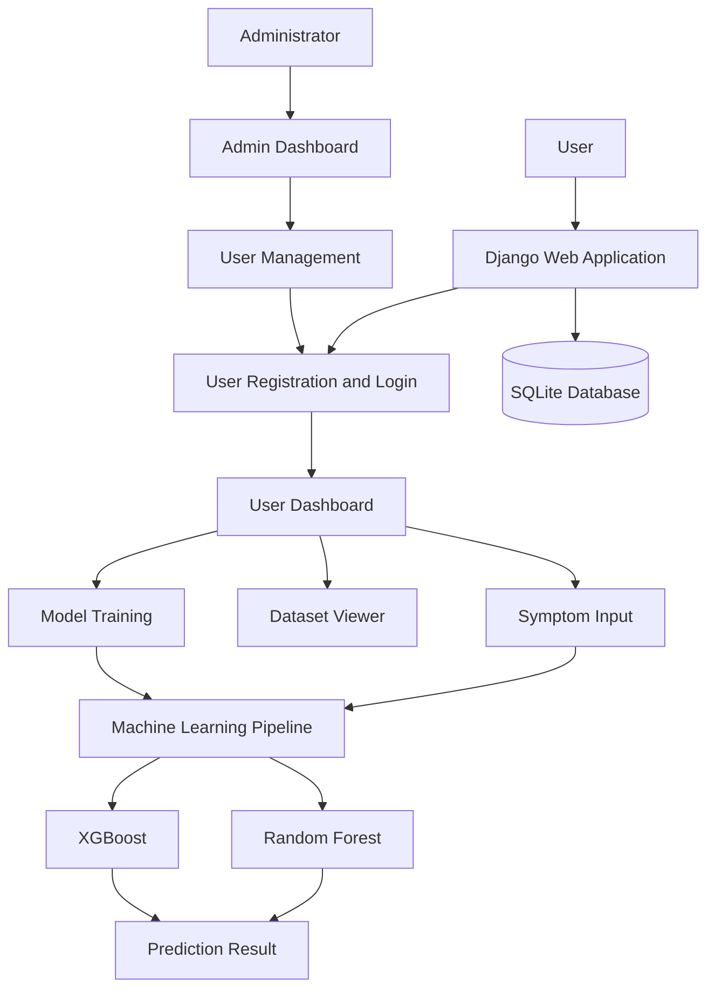
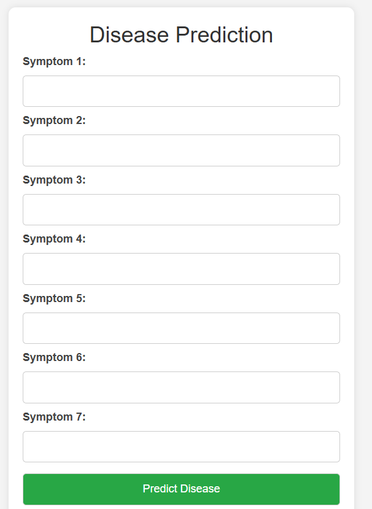
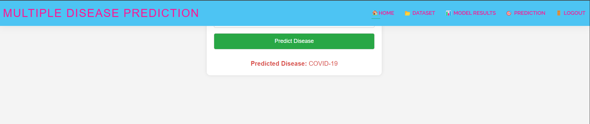
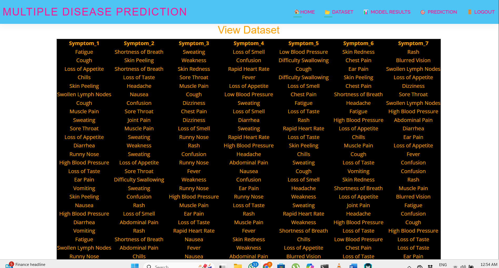

<div align="center">

# 🩺 Multiple Disease Detection System

[](https://www.python.org/)
[](https://www.djangoproject.com/)
[](https://ai.google.dev/)
[](https://scikit-learn.org/)
[-success.svg)](http://www.ijaresm.com/)

A machine learning-based web application developed using Python and Django to predict diseases based on user-provided symptoms. The project includes user registration, administrator account activation, dataset viewing, model training, and disease prediction.

[Explore Features](#-key-features) • [Installation Guide](#-quick-start) • [Publication Details](#-research--publication)

</div>


---


 ## 📖 Overview

The Multiple Disease Prediction System is a web-based application designed to provide disease prediction using machine learning techniques.

The application provides an interface for users to register, log in, enter symptoms, and view prediction results. It also includes administrator functionality for managing user accounts and activating registered users.

The project focuses on applying machine learning algorithms to disease prediction through a Django web application.

## ✨ Features

* User registration and login
* Administrator login and dashboard
* Admin-controlled user activation
* Registered user management
* Dataset viewing
* Machine learning model training
* Symptom-based disease prediction
* Prediction results interface
* Django-based web application

## 🛠️ Technology Stack

| Category             | Technologies                                 |
| -------------------- | -------------------------------------------- |
| Programming Language | Python                                       |
| Web Framework        | Django                                       |
| Machine Learning     | Scikit-learn, Random Forest, XGBoost         |
| Data Processing      | Pandas, NumPy                                |
| Database             | SQLite                                       |
| Frontend             | HTML, CSS, JavaScript                        |
| Model Storage        | Pickle (.pkl), if used by the implementation |

## 🏗️ System Architecture



## 📂 Project Structure

The following is a suggested structure. Update it to match the actual folders and files in your repository.

```text
multiple-disease-detection/
│
├── README.md
├── requirements.txt
├── .gitignore
├── manage.py
│
├── Multiple_Disease_Detection/
│   ├── settings.py
│   ├── urls.py
│   ├── views.py
│   ├── asgi.py
│   └── wsgi.py
│
├── users/
│   ├── views.py
│   ├── models.py
│   └── forms.py
│
├── admins/
│   └── views.py
│
├── templates/
├── static/
├── dataset/
├── models/
│
└── docs/
    └── screenshots/
```

## 🖥️ Application Preview

The following section uses screenshots from the actual application. Upload the image files into a folder named `docs/screenshots/` in your GitHub repository, then use the corresponding Markdown image paths.

### 1. Home Page


### 2. User Registration


### 3. User Login


### 4. User Dashboard


### 5. Symptom Input



### 6. Prediction Output



### 7. Model Results


### 8. Dataset Viewer



### 9. Admin Login


### 10. Admin Dashboard


### 11. Registered Users


> **Note:** The screenshot filenames above are suggested names. Rename your uploaded screenshots accordingly, or update the Markdown paths to match your actual filenames.

## 🧠 Machine Learning

The project documentation describes a machine learning pipeline for disease prediction.

The algorithms identified for the prediction workflow are:

* Random Forest
* XGBoost

The project has also been described as using a six-classifier machine learning pipeline. The remaining classifier names and their exact roles should be confirmed from the original training implementation before listing them individually.

### Machine Learning Workflow

1. Load the dataset.
2. Prepare the data for model training.
3. Train the machine learning models.
4. Process user-provided symptoms.
5. Generate a prediction using the configured model.
6. Display the prediction result through the Django interface.

> Add the exact preprocessing steps, dataset details, model evaluation metrics, and classifier names after verifying them from the implementation.

## ⚙️ Installation and Setup

### 1. Clone the Repository

```bash
git clone https://github.com/DARSHANBAISANE/multiple-disease-detection.git
cd multiple-disease-detection
```

### 2. Create a Virtual Environment

```bash
python -m venv env
```

Activate it on Windows:

```powershell
.\env\Scripts\Activate.ps1
```

Activate it on macOS or Linux:

```bash
source env/bin/activate
```

### 3. Install Dependencies

Use the dependency filename that exists in your repository.

```bash
pip install -r requirements.txt
```

If your file is named `requirments.txt`, use that filename instead.

### 4. Apply Database Migrations

```bash
python manage.py migrate
```

### 5. Run the Application

```bash
python manage.py runserver
```

Open the local development address shown in your terminal, typically:

```text
http://127.0.0.1:8000/
```

## 🚀 Usage

1. Run the Django application.
2. Open the home page in your browser.
3. Register a new user account.
4. Activate the account through the administrator interface if required.
5. Log in to the user dashboard.
6. Enter symptoms on the prediction page.
7. View the prediction result.
8. Explore the dataset and model-training features.

## 🔐 Security

* Do not publish passwords or secret credentials.
* Keep private configuration files out of GitHub.
* Change any default administrator credentials.
* Use secure Django settings before deploying publicly.
* Do not expose sensitive user information.

## ⚠️ Limitations

* Predictions may be inaccurate or incomplete.
* Results depend on the quality of the dataset and model implementation.
* The system is intended for educational and research purposes.
* Predictions must not be used as a substitute for professional medical advice, diagnosis, or treatment.
* The project should not be considered clinically validated without appropriate evidence.

## 📄 Research Publication

The project documentation references a publication in **IJARESM, Volume 13, Issue 4, April 2025**.

https://drive.google.com/file/d/1cVhpGdXQQ9johUM8lUf39W4_qKFa3rJ_/view?usp=sharing

## 👨‍💻 Author

**Darshan Baisane**

* GitHub: [DARSHANBAISANE](https://github.com/DARSHANBAISANE)
* Project Repository: [Multiple Disease Detection](https://github.com/DARSHANBAISANE/multiple-disease-detection)

---

⭐ If you find this project interesting, feel free to explore the repository.
